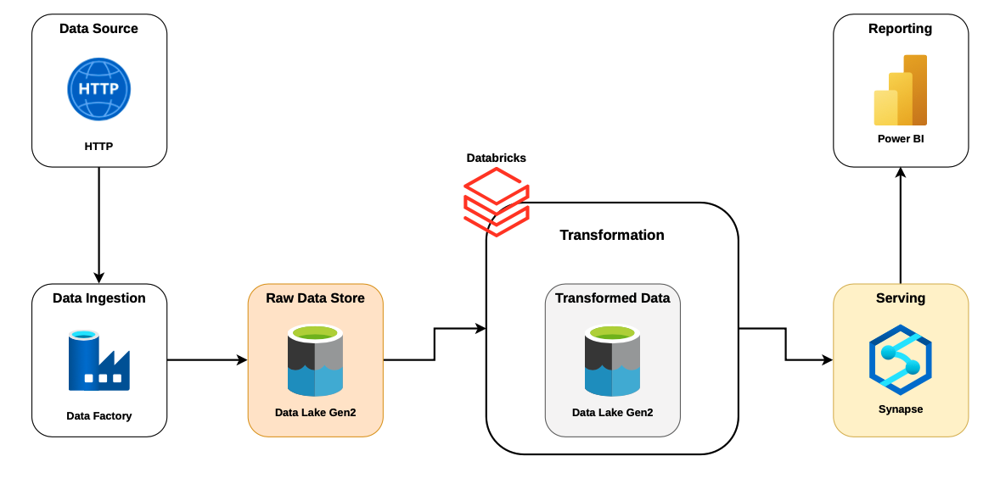

# Azure End-to-End Data Engineering Project

This project demonstrates a complete Azure Data Engineering pipeline built using modern cloud technologies.

## Architecture

## Dataset

Retail sales dataset containing:

- Customers
- Products
- Product Categories
- Product Subcategories
- Sales (2015–2017)
- Returns
- Territories
- Calendar data

## Data Pipeline

1. Data Ingestion using **Azure Data Factory**
2. Raw data stored in **Azure Data Lake Gen2 (Bronze Layer)**
3. Data transformation using **Azure Databricks (PySpark)** → Silver Layer
4. Data loaded into **Azure Synapse Analytics (Gold Layer)**
5. Reporting with **Power BI**

## Tech Stack

- Azure Data Factory
- Azure Data Lake Gen2
- Azure Databricks
- PySpark
- Azure Synapse Analytics
- Power BI
- Apache Spark

## Key Features

- Medallion Architecture (Bronze / Silver / Gold)
- ETL pipeline automation
- Big data transformations with Spark
- Data warehouse integration with Synapse
- Business reporting using Power BI
